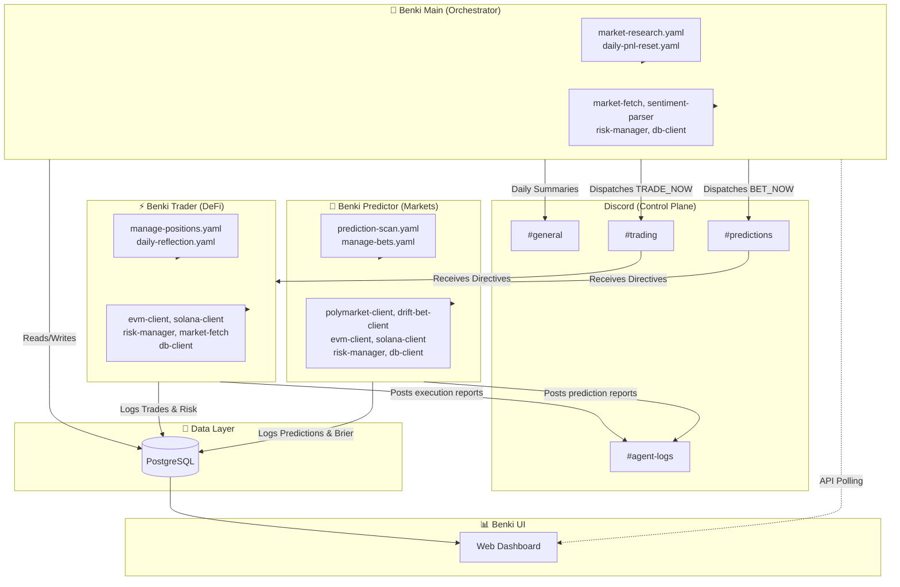

# Benki Multi-Agent Crypto System Architecture

The **Benki** system is a sophisticated multi-agent crypto trading and prediction market platform powered by the Hermes framework. It uses a human-in-the-loop oversight model via Discord, strict risk management protocols, and autonomous cron-driven market analysis.

## 🏗️ High-Level Architecture Visual

---

## 🤖 Agents & Functionality

### 1. Benki Main (Orchestrator)
The brain of the system. It is strictly observational and analytical, and **never executes trades itself**.
- **Role:** Ingests live market data, reads news, generates sentiment, and evaluates macro conditions.
- **Workflow:** 
  - A cron job (`market-research.yaml`) periodically prompts the agent to fetch prices, Polymarket odds, Fear & Greed indices, and news.
  - It constructs a structured **Market Context Brief (MCB)**.
  - It dispatches explicit `TRADE_NOW` or `BET_NOW` directives to the Trader and Predictor agents via dedicated Discord channels.
- **Plugins/Skills used:** `market-fetch`, `sentiment-parser`, `db-client`, `risk-manager`.

### 2. Benki Trader (DeFi Execution)
The execution arm for standard crypto trades (spot trading on DEXs).
- **Role:** Executes trades on Solana (via Jupiter) and Polygon (via Uniswap).
- **Workflow:**
  - Receives `TRADE_NOW` from the Orchestrator.
  - Computes optimal position sizing using the **Kelly Criterion** based on the current portfolio value and confidence/win probability.
  - Checks if the trade passes the momentum filter (e.g., token 24h performance > BTC).
  - Must get explicit **approval from the `risk-manager` plugin** (circuit breaker and max drawdown checks).
  - Executes trade, setting Take-Profit (+15-20%) and Stop-Loss (-5-8%).
  - The `manage-positions.yaml` cron routinely monitors and closes positions when TP/SL targets hit.
- **Plugins/Skills used:** `evm-client`, `solana-client`, `risk-manager`, `market-fetch`, `db-client`.

### 3. Benki Predictor (Prediction Markets)
The specialist for betting on event outcomes where the crowd is mispricing probability.
- **Role:** Places bets on Polymarket (Polygon) and Drift BET (Solana).
- **Workflow:**
  - Has two pathways: responding to `BET_NOW` from Orchestrator OR doing its own independent probabilistic scans (`prediction-scan.yaml`).
  - Calculates its own Bayesian probability based on search/news and compares it to the market's implied odds.
  - Executes only if it identifies an **edge > 5%**.
  - Its `manage-bets.yaml` cron job tracks market resolutions and calculates the agent's **Brier Score** (calibration). If Brier score worsens, it automatically increases its required edge margin.
- **Plugins/Skills used:** `polymarket-client`, `drift-bet-client`, `evm-client`, `solana-client`, `risk-manager`, `db-client`.

---

## 💾 Memory & Database Schema (PostgreSQL)

The system relies heavily on both file-based vector memory (`MEMORY.md` standard to Hermes) and structured PostgreSQL storage for immutable auditability.

**Core Database Tables (`init.sql`):**
- `trades`: Tracks all executions (buy, sell, bet_yes, bet_no), chain, platform, and tx_hashes.
- `daily_pnl`: Maintains starting/ending balances, realized/unrealized P&L, drawdown percentage, and circuit breaker status. (Reset automatically by Orchestrator cron).
- `sentiment_briefs`: Historical log of the Orchestrator's market context analyses.
- `risk_audit_log`: Immutable, append-only log storing every `risk_manager` approval or rejection, complete with position size calculated and current drawdown limits.
- `cron_logs`: Tracks the execution success/failure of automated cron loops.
- `predictions`: Advanced tracking of prediction market bets, including `my_probability`, `market_probability`, `edge`, and the computed `brier_score` upon resolution.

**File Memory (`MEMORY.md`):**
Agents use `MEMORY.md` internally via their native Hermes context loop to remember open positions, active TP/SL levels, and their personal calibration metrics (e.g., the Predictor's running Brier score).

---

## 🛡️ Risk Management

Risk Management is hardcoded as a plugin to ensure LLM hallucinations cannot bypass limits.
- **Position Sizing:** Trader uses Kelly Fraction, mapped to the dynamically queried PostgreSQL portfolio value. Max position size is hardcapped (e.g., 5%).
- **Drawdown Limit & Circuit Breakers:** If `daily_pnl.drawdown_pct` crosses the hard threshold (e.g., 10%), the `risk-manager` plugin intercepts the LLM tool execution and returns a REJECTED status, preventing the transaction from being constructed or signed.
- **Dry Run Mode:** Agents fully support a configurable `DRY_RUN` toggle in their `.env` files that simulates executions without broadcasting to the blockchain, perfect for strategy testing.
