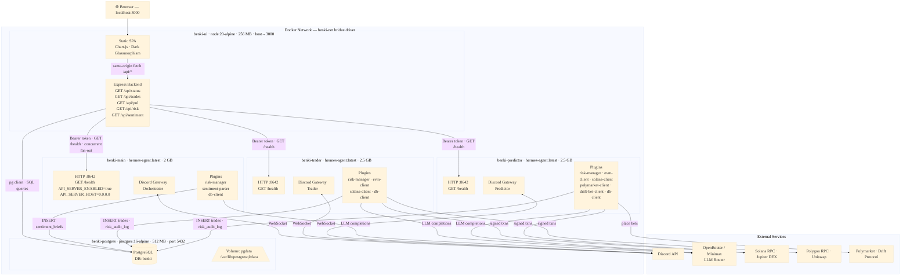
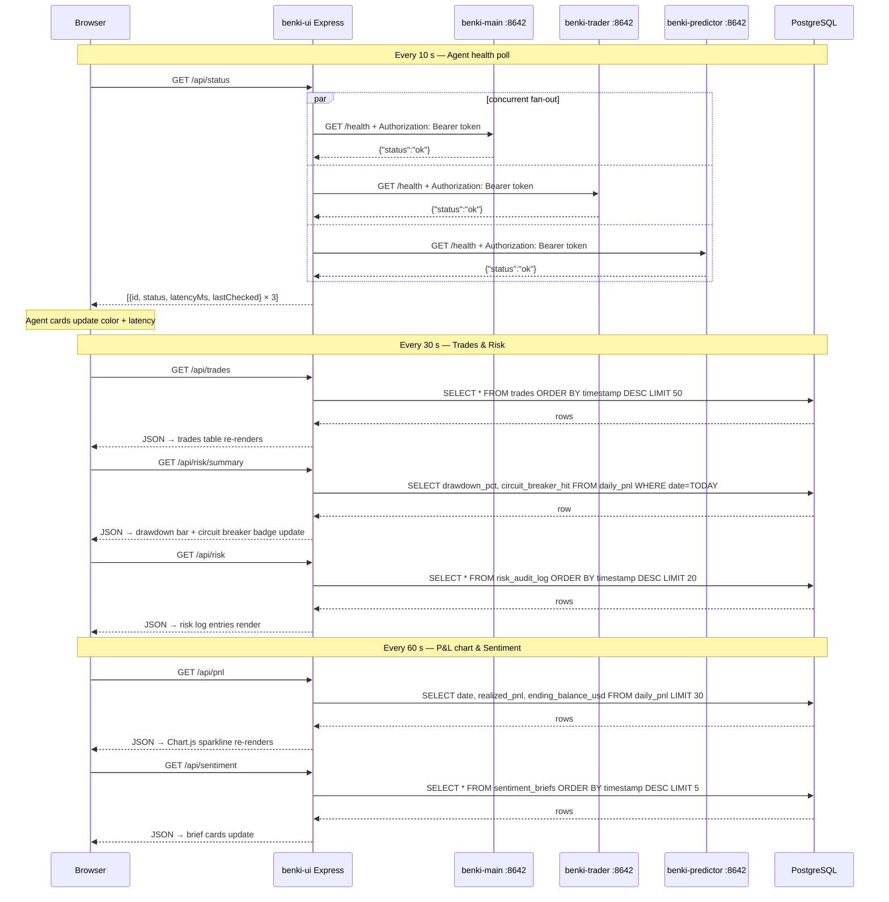

# Benki Multi-Agent System — Implementation Plan (v2)

Full system: PostgreSQL + 3 Hermes agent gateways + 1 web dashboard, all containerised.

---

## Architecture

### System Overview



---

### Dashboard Polling Sequence



---

### Volume Mounts

| Container | Host path | Container path | Purpose |
|---|---|---|---|
| `benki-postgres` | Docker volume `pgdata` | `/var/lib/postgresql/data` | Persistent DB storage |
| `benki-main` | Docker volume `main-data` | `/opt/data` | Agent memory, MEMORY.md |
| `benki-main` | `./plugins/risk-manager` | `/opt/data/plugins/risk-manager` | Plugin (read-only) |
| `benki-main` | `./plugins/sentiment-parser` | `/opt/data/plugins/sentiment-parser` | Plugin (read-only) |
| `benki-main` | `./configs/main/config.yaml` | `/opt/data/config.yaml` | Config overlay (read-only) |
| `benki-trader` | Docker volume `trader-data` | `/opt/data` | Agent memory |
| `benki-trader` | `./plugins/evm-client` | `/opt/data/plugins/evm-client` | Plugin (read-only) |
| `benki-trader` | `./plugins/solana-client` | `/opt/data/plugins/solana-client` | Plugin (read-only) |
| `benki-predictor` | Docker volume `predictor-data` | `/opt/data` | Agent memory |
| `benki-predictor` | `./plugins/polymarket-client` | `/opt/data/plugins/polymarket-client` | Plugin (read-only) |
| `benki-predictor` | `./plugins/drift-bet-client` | `/opt/data/plugins/drift-bet-client` | Plugin (read-only) |
| `benki-ui` | _(none — built into image)_ | `/app/public` | Served static files |


## Human-in-the-Loop

The system is configured to require human judgment and confirmation for low-confidence market signals, uncertain trades, or bets. The designated Discord users who act as the Human-in-the-Loop (HITL) are **`vernon_bella`** and **`bud916`**. The agents (`benki-main`, `benki-trader`, `benki-predictor`) are explicitly prompted to escalate uncertain decisions to these users.

---

## Key Technical Findings

| Question | Answer |
|---|---|
| Hermes gateway port | **8642** (default, configurable via `API_SERVER_PORT`) |
| Health endpoint | `GET /health` → `{"status":"ok"}` |
| API server default state | **Disabled** (`API_SERVER_ENABLED=false`) |
| Default bind address | `127.0.0.1` (loopback only — invisible to other containers) |
| Auth requirement | Bearer token **required** when binding to `0.0.0.0` |

> [!IMPORTANT]
> Without `API_SERVER_ENABLED=true` and `API_SERVER_HOST=0.0.0.0`, the
> dashboard cannot reach the gateways even though they're on the same Docker network.
> These are now set in `docker-compose.yml` for all three agent services.

---

## Files — Complete Reference

### New: `ui/` directory

| File | Description |
|---|---|
| `ui/Dockerfile` | `node:20-alpine` image; installs `express` + `pg`; exposes 3000 |
| `ui/package.json` | Minimal manifest — no dev deps |
| `ui/server.js` | Express app: `/api/status`, `/api/trades`, `/api/pnl`, `/api/risk`, `/api/sentiment`, `/api/risk/summary`, `/api/ping` |
| `ui/public/index.html` | SPA — agent cards, P&L chart, risk monitor, trades table, sentiment briefs |
| `ui/public/style.css` | Dark glassmorphism; Inter + JetBrains Mono; animated pulse dots; responsive |
| `ui/public/app.js` | Polls all endpoints on configurable intervals; updates DOM in-place |

### Modified: project root

| File | Change |
|---|---|
| `docker-compose.yml` | Added `API_SERVER_ENABLED/HOST/PORT/KEY` to all 3 agent services; added `benki-ui` service |
| `.env` | Added `API_SERVER_KEY` placeholder |

### Unchanged

Everything else — `init.sql`, `configs/`, `plugins/`, `skills/`, `setup.sh`.

---

## Dashboard Panels & Data Sources

| Panel | Endpoint | Poll rate | DB table |
|---|---|---|---|
| Agent status cards | `/api/status` | 10 s | _(live HTTP to gateways)_ |
| P&L sparkline | `/api/pnl` | 60 s | `daily_pnl` |
| Risk monitor | `/api/risk/summary` + `/api/risk` | 30 s | `daily_pnl`, `risk_audit_log` |
| Trades feed | `/api/trades` | 30 s | `trades` |
| Sentiment briefs | `/api/sentiment` | 60 s | `sentiment_briefs` |

---

## Implementation Steps

Follow these in order **before** running `docker compose up`.

### Operational Guide: How to use the Agents

**1. Interacting with the Agents**
The agents run natively on Discord. To interact with them, simply go to your Discord server and `@mention` them in any channel they have access to (such as `#agent-logs` or your main trading channel). 
- Example: `@Benki Orchestrator Please run an analysis on Solana ecosystem tokens.`
- **Human-in-the-Loop**: When agents are unsure or about to execute trades, they will actively tag you (`@vernon_bella` or `@bud916`) in the channel asking for approval. Simply reply with "Approved" or "Cancel" and tag them back.

**2. Paper Trading vs. Live Trading**
By default, the agents are configured to run in safe "Dry Run" mode. They will evaluate trades and hit the database, but will not sign actual transactions.
- To enable **Live Trading**: Open `configs/trader/.env` and `configs/predictor/.env` and change `DRY_RUN=true` to `DRY_RUN=false`. 
- To enable **Paper Trading**: Keep `DRY_RUN=true`.
*(You must restart the containers using `docker compose restart benki-trader benki-predictor` for changes to take effect).*

**3. Kill Switches and Safety**
- **Automated Circuit Breaker**: The `risk-manager` plugin has a hardcoded 10% daily drawdown limit. If the agents lose 10% of their portfolio in a single day, ALL trading is automatically halted until 00:00 UTC the next day. The LLM cannot bypass this.
- **Soft Kill Switch**: You can tell the orchestrator in Discord: `@Benki Orchestrator HALT ALL TRADING OPERATIONS`. It will instruct the trader and predictor to stand down.
- **Hard Kill Switch**: If you need to physically pull the plug, stop the execution containers from your terminal:
  ```powershell
  docker compose stop benki-trader benki-predictor
  ```
  *(This leaves the DB and dashboard running so you can review what happened).*

---


### Step 1 — Generate a secure API key

The `API_SERVER_KEY` in `.env` currently reads `CHANGE_ME_BEFORE_FIRST_RUN`.
Replace it with a real random secret. In PowerShell:

```powershell
# Copy the output and paste it as the value of API_SERVER_KEY in .env
-join ((1..32) | ForEach-Object { '{0:X2}' -f (Get-Random -Maximum 256) })
```

Or if you have OpenSSL (Git Bash / WSL):
```bash
openssl rand -base64 32
```

Open `.env` and set:
```
API_SERVER_KEY=<paste your generated key here>
```

> [!CAUTION]
> Do not skip this step. If you leave `CHANGE_ME_BEFORE_FIRST_RUN` as the key,
> anyone on the same machine who knows the default can call the agent APIs.

---

### Step 2 — Verify the `.env` file looks correct

`d:\Hermes\hermes_setup_new\hermes_agent_build\.env` should now contain:

```dotenv
# Docker Compose root secrets
POSTGRES_PASSWORD=Hermes@123

# Shared bearer token for the Hermes API server
API_SERVER_KEY=<your generated key>
```

---

### Step 3 — Confirm all per-agent `.env` files are populated

The agent containers load their individual secrets from:
- `configs/main/.env`
- `configs/trader/.env`
- `configs/predictor/.env`

These files must exist and contain at minimum:
```dotenv
DISCORD_TOKEN=...
OPENROUTER_API_KEY=...   # or whichever LLM provider you use
```

The API server vars (`API_SERVER_ENABLED`, `API_SERVER_HOST`, etc.) are
injected via `docker-compose.yml` and do **not** need to be in these files.

---

### Step 4 — Build and start all services

```powershell
# From the project root
cd d:\Hermes\hermes_setup_new\hermes_agent_build

# Build benki-ui image and start everything
docker compose up -d --build
```

Expected startup order (enforced by `depends_on`):
1. `postgres` starts → passes healthcheck
2. `benki-main`, `benki-trader`, `benki-predictor`, `benki-ui` start in parallel

---

### Step 5 — Verify the dashboard is reachable

```powershell
# Should return {"ok":true}
curl http://localhost:3000/api/ping

# Should return array of 3 agent status objects
curl http://localhost:3000/api/status
```

Open **http://localhost:3000** in your browser.

Agent cards will show 🔴 **Offline** initially while the Hermes gateway is
still initialising. They will flip to 🟢 **Online** within one poll cycle
(~10 seconds) once each gateway is ready.

---

### Step 6 — Verify agent API servers are reachable (optional debug)

If an agent stays red, you can check directly from within the Docker network:

```powershell
# Exec into benki-ui and test connectivity to benki-main
docker exec -it benki-ui wget -qO- \
  --header="Authorization: Bearer <your API_SERVER_KEY>" \
  http://benki-main:8642/health
```

Expected response: `{"status":"ok"}` or similar JSON.

If you get `connection refused`, the gateway hasn't enabled its API server yet —
check the agent logs:
```powershell
docker logs benki-main --tail 50
```

---

### Step 7 — Ongoing operations

| Task | Command |
|---|---|
| View all logs | `docker compose logs -f` |
| View dashboard logs only | `docker logs -f benki-ui` |
| Restart just the dashboard | `docker compose restart benki-ui` |
| Rebuild dashboard after code change | `docker compose up -d --build benki-ui` |
| Stop everything | `docker compose down` |
| Stop + wipe volumes (⚠ loses DB data) | `docker compose down -v` |

---

## Environment Variable Reference

### Root `.env`
| Variable | Used by | Purpose |
|---|---|---|
| `POSTGRES_PASSWORD` | `postgres`, `benki-ui` | DB password |
| `API_SERVER_KEY` | all 3 agents, `benki-ui` | Shared bearer token for Hermes HTTP API |

### `benki-ui` service (set in `docker-compose.yml`)
| Variable | Default | Purpose |
|---|---|---|
| `DATABASE_URL` | _(constructed)_ | PostgreSQL connection string |
| `API_SERVER_KEY` | from `.env` | Bearer token forwarded in health requests |
| `GATEWAY_PORT` | `8642` | Port each Hermes gateway listens on |
| `HEALTH_PATH` | `/health` | Health endpoint path |
| `MAIN_HOST` | `benki-main` | Container hostname of orchestrator |
| `TRADER_HOST` | `benki-trader` | Container hostname of trader |
| `PREDICTOR_HOST` | `benki-predictor` | Container hostname of predictor |
